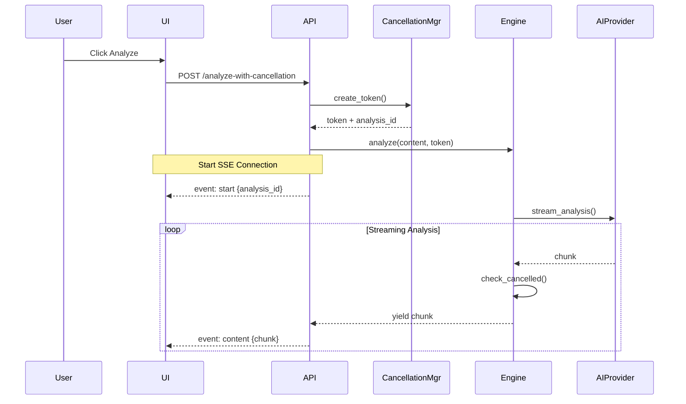
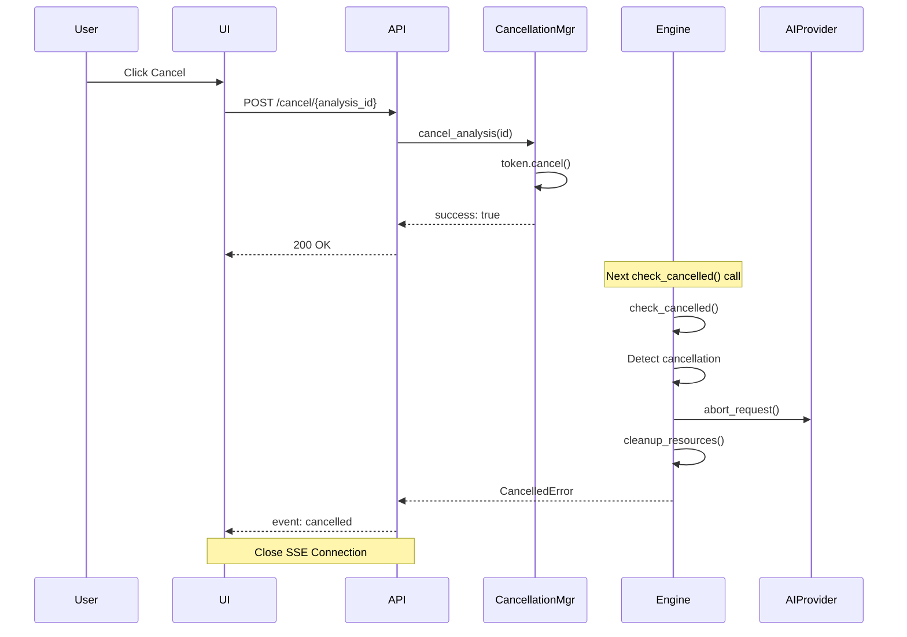
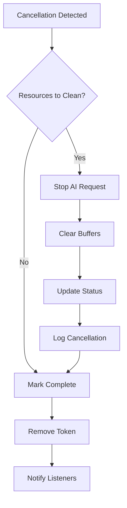

# 取消機制流程設計文檔

## 概述

ANR/Tombstone AI 分析系統的取消機制允許使用者在分析過程中隨時取消正在進行的操作。這對於處理大型日誌檔案或當使用者意識到提交了錯誤的內容時特別有用。

## 設計目標

1. **即時響應**：取消操作應該立即生效
2. **資源清理**：確保所有資源被正確釋放
3. **狀態一致性**：取消後系統狀態保持一致
4. **使用者友好**：提供清晰的取消狀態反饋

## 架構設計

### 核心組件

```
┌─────────────────────────────────────────────────────┐
│                   Client (UI)                        │
│  ┌─────────────┐              ┌─────────────┐      │
│  │   Analyze   │              │   Cancel    │      │
│  │   Button    │              │   Button    │      │
│  └──────┬──────┘              └──────┬──────┘      │
└─────────┼─────────────────────────────┼────────────┘
          │                             │
          ▼                             ▼
┌─────────────────────────────────────────────────────┐
│                    API Layer                         │
│  ┌─────────────────────┐    ┌─────────────────┐   │
│  │  /analyze-with-     │    │  /cancel/{id}   │   │
│  │  cancellation (SSE) │    │     (POST)      │   │
│  └──────────┬──────────┘    └────────┬────────┘   │
└─────────────┼─────────────────────────┼────────────┘
              │                         │
              ▼                         ▼
┌─────────────────────────────────────────────────────┐
│              Cancellation Manager                    │
│  ┌─────────────────┐    ┌─────────────────────┐   │
│  │ Create Token    │    │  Cancel Analysis    │   │
│  │ (analysis_id)   │    │  (analysis_id)      │   │
│  └─────────┬───────┘    └──────────┬──────────┘   │
└────────────┼───────────────────────┼───────────────┘
             │                       │
             ▼                       ▼
┌─────────────────────────────────────────────────────┐
│               Analysis Engine                        │
│  ┌──────────────────┐    ┌──────────────────┐     │
│  │ Check Token      │◄───│ Receive Cancel   │     │
│  │ During Stream    │    │ Signal           │     │
│  └──────────────────┘    └──────────────────┘     │
└─────────────────────────────────────────────────────┘
```

### 類別設計

```python
class CancellationToken:
    """取消令牌"""
    def __init__(self, analysis_id: str):
        self.analysis_id = analysis_id
        self.is_cancelled = False
        self.created_at = time.time()
        self.cancelled_at = None
        self._callbacks = []
        self._lock = asyncio.Lock()
    
    def cancel(self):
        """取消操作"""
        if not self.is_cancelled:
            self.is_cancelled = True
            self.cancelled_at = time.time()
            self._trigger_callbacks()
    
    async def check_cancelled_async(self):
        """非同步檢查是否已取消"""
        if self.is_cancelled:
            raise asyncio.CancelledError()

class CancellationManager:
    """取消管理器"""
    def __init__(self):
        self._tokens: Dict[str, CancellationToken] = {}
        self._lock = asyncio.Lock()
    
    async def create_token(self, analysis_id: str) -> CancellationToken:
        """創建新的取消令牌"""
        async with self._lock:
            token = CancellationToken(analysis_id)
            self._tokens[analysis_id] = token
            return token
    
    async def cancel_analysis(self, analysis_id: str) -> bool:
        """取消指定的分析"""
        async with self._lock:
            token = self._tokens.get(analysis_id)
            if token and not token.is_cancelled:
                token.cancel()
                return True
            return False
```

## 執行流程

### 1. 開始分析流程



### 2. 取消流程



### 3. 清理流程



## 實作細節

### 1. 在分析器中整合取消檢查

```python
class AnthropicApiStreamingANRAnalyzer:
    async def analyze_anr_async(
        self, 
        content: str, 
        mode: AnalysisMode
    ) -> AsyncIterator[str]:
        try:
            # 創建 AI 請求
            stream = await self._client.messages.create(...)
            
            # 串流處理
            async for event in stream:
                # 檢查取消狀態
                if self._cancellation_token:
                    await self._cancellation_token.check_cancelled_async()
                
                # 處理事件
                if event.type == 'content_block_delta':
                    yield event.delta.text
                    
        except asyncio.CancelledError:
            # 清理資源
            await self._cleanup()
            # 重新拋出以通知上層
            raise
        except Exception as e:
            logger.error(f"Analysis error: {e}")
            raise
```

### 2. SSE 端點實作

```python
# 可取消的分析 API (SSE)
@app.route('/api/ai/analyze-with-cancellation', methods=['POST'])
def analyze_with_cancellation():
    """可取消的分析 API（Server-Sent Events）"""
    data = request.get_json()
    
    # 從 POST body 獲取參數
    content = data.get('content', '')
    log_type = data.get('log_type', 'anr')
    mode = data.get('mode', 'intelligent')
    provider = data.get('provider', 'anthropic')
    
    # 驗證必要參數
    if not content:
        return jsonify({
            'status': 'error',
            'message': 'Content is required'
        }), 400
    
    # 檢查是否應該使用 mock 模式（用於測試）
    use_mock = os.getenv('USE_MOCK_ANALYSIS', 'false').lower() == 'true'
    
    if use_mock:
        # 使用 mock 版本
        return analyze_with_cancellation_mock_impl(content, log_type, mode, provider)
    
    def generate():
        """生成 SSE 事件流"""
        import asyncio
        from src.core.engine import CancellableAiAnalysisEngine, CancellationException
        
        analysis_id = str(uuid.uuid4())
        
        # 創建新的事件循環來運行異步代碼
        loop = asyncio.new_event_loop()
        asyncio.set_event_loop(loop)
        
        try:
            # 開始事件
            yield f"data: {json.dumps({'type': 'start', 'analysis_id': analysis_id})}\n\n"
            
            # 獲取或創建分析引擎
            engine = current_app.config.get('ANALYSIS_ENGINE')
            if not engine:
                # 如果沒有配置引擎，使用 mock 版本
                print("Warning: Analysis engine not configured, falling back to mock")
                loop.close()
                return analyze_with_cancellation_mock_impl(content, log_type, mode, provider)
            
            # 執行分析
            from src.config.base import AnalysisMode, ModelProvider
            
            # 轉換參數
            analysis_mode = AnalysisMode(mode)
            model_provider = ModelProvider(provider) if provider else None
            
            # 追蹤進度
            chunk_count = 0
            total_chunks = 1  # 初始值，實際會動態更新
            
            # 創建異步生成器的同步包裝
            async def async_analyze():
                async for chunk in engine.analyze_with_cancellation(
                    content=content,
                    log_type=log_type,
                    mode=analysis_mode,
                    provider=model_provider,
                    analysis_id=analysis_id
                ):
                    yield chunk
            
            # 使用引擎分析
            async_gen = async_analyze()
            while True:
                try:
                    chunk = loop.run_until_complete(async_gen.__anext__())
                    
                    # 發送內容
                    yield f"data: {json.dumps({'type': 'content', 'content': chunk})}\n\n"
                    
                    # 更新進度
                    chunk_count += 1
                    progress = min(chunk_count * 10, 90)  # 最多到 90%
                    
                    # 獲取狀態
                    status = engine.get_status()
                    if 'api_usage' in status:
                        api_usage = status['api_usage']
                        yield f"data: {json.dumps({'type': 'progress', 'progress': {'progress_percentage': progress, 'current_chunk': chunk_count, 'total_chunks': total_chunks, 'input_tokens': api_usage.get('input_tokens', 0), 'output_tokens': api_usage.get('output_tokens', 0)}})}\n\n"
                        
                except StopAsyncIteration:
                    break
            
            # 完成事件
            yield f"data: {json.dumps({'type': 'complete'})}\n\n"
            
        except CancellationException:
            yield f"data: {json.dumps({'type': 'cancelled'})}\n\n"
        except Exception as e:
            yield f"data: {json.dumps({'type': 'error', 'error': str(e)})}\n\n"
            import traceback
            traceback.print_exc()
        finally:
            loop.close()
    
    return Response(
        generate(), 
        mimetype='text/event-stream',
        headers={
            'Cache-Control': 'no-cache',
            'X-Accel-Buffering': 'no',
            'Connection': 'keep-alive'
        }
    )
```

### 3. 取消端點實作

```python
@app.route('/api/ai/cancel/<analysis_id>', methods=['POST'])
async def cancel_analysis(analysis_id: str):
    try:
        # 執行取消
        success = await cancellation_manager.cancel_analysis(analysis_id)
        
        if success:
            return jsonify({
                'success': True,
                'data': {
                    'analysis_id': analysis_id,
                    'cancelled': True,
                    'timestamp': datetime.utcnow().isoformat()
                }
            })
        else:
            return jsonify({
                'success': False,
                'error': 'Analysis not found or already completed'
            }), 404
            
    except Exception as e:
        return jsonify({
            'success': False,
            'error': str(e)
        }), 500
```

## 前端整合

### 1. React 組件範例

```javascript
function AnalysisComponent() {
    const [isAnalyzing, setIsAnalyzing] = useState(false);
    const [analysisId, setAnalysisId] = useState(null);
    const [result, setResult] = useState('');
    const eventSourceRef = useRef(null);
    
    const startAnalysis = async () => {
        setIsAnalyzing(true);
        setResult('');
        
        const eventSource = new EventSource(
            '/api/ai/analyze-with-cancellation',
            {
                method: 'POST',
                headers: {
                    'Content-Type': 'application/json',
                    'Authorization': `Bearer ${token}`
                },
                body: JSON.stringify({
                    content: logContent,
                    log_type: 'anr',
                    mode: 'intelligent'
                })
            }
        );
        
        eventSourceRef.current = eventSource;
        
        eventSource.onmessage = (event) => {
            const data = JSON.parse(event.data);
            
            switch (data.type) {
                case 'start':
                    setAnalysisId(data.analysis_id);
                    break;
                    
                case 'content':
                    setResult(prev => prev + data.content);
                    break;
                    
                case 'progress':
                    updateProgress(data.progress);
                    break;
                    
                case 'complete':
                    setIsAnalyzing(false);
                    eventSource.close();
                    break;
                    
                case 'cancelled':
                    setIsAnalyzing(false);
                    setResult(prev => prev + '\n\n[分析已取消]');
                    eventSource.close();
                    break;
                    
                case 'error':
                    setIsAnalyzing(false);
                    handleError(data.error);
                    eventSource.close();
                    break;
            }
        };
    };
    
    const cancelAnalysis = async () => {
        if (!analysisId) return;
        
        try {
            const response = await fetch(
                `/api/ai/cancel/${analysisId}`,
                {
                    method: 'POST',
                    headers: {
                        'Authorization': `Bearer ${token}`
                    }
                }
            );
            
            if (response.ok) {
                // 關閉 SSE 連接
                if (eventSourceRef.current) {
                    eventSourceRef.current.close();
                }
            }
        } catch (error) {
            console.error('Cancel failed:', error);
        }
    };
    
    return (
        <div>
            <button 
                onClick={startAnalysis}
                disabled={isAnalyzing}
            >
                開始分析
            </button>
            
            <button 
                onClick={cancelAnalysis}
                disabled={!isAnalyzing}
            >
                取消分析
            </button>
            
            <div>{result}</div>
        </div>
    );
}
```

## 錯誤處理

### 1. 取消相關錯誤

```python
class CancellationError(Exception):
    """取消操作錯誤"""
    pass

class AlreadyCancelledError(CancellationError):
    """嘗試取消已取消的操作"""
    pass

class CancellationNotFoundError(CancellationError):
    """找不到要取消的操作"""
    pass
```

### 2. 錯誤處理策略

```python
async def handle_cancellation(analysis_id: str):
    try:
        success = await cancellation_manager.cancel_analysis(analysis_id)
        if not success:
            raise CancellationNotFoundError(
                f"Analysis {analysis_id} not found"
            )
    except CancellationNotFoundError:
        # 記錄但不中斷 - 可能已完成
        logger.warning(f"Cannot cancel {analysis_id}: not found")
        return False
    except Exception as e:
        # 意外錯誤 - 記錄並重新拋出
        logger.error(f"Cancellation error: {e}")
        raise
```

## 效能考量

### 1. 檢查頻率

```python
class StreamingAnalyzer:
    def __init__(self):
        self.check_interval = 100  # 每 100 個字元檢查一次
        self.chars_since_check = 0
    
    async def stream_with_cancellation(self):
        async for chunk in self.ai_stream():
            # 不要每個 chunk 都檢查（效能考量）
            self.chars_since_check += len(chunk)
            
            if self.chars_since_check >= self.check_interval:
                await self.check_cancelled()
                self.chars_since_check = 0
            
            yield chunk
```

### 2. 資源清理

```python
async def cleanup_on_cancellation():
    """取消時的資源清理"""
    cleanup_tasks = []
    
    # 1. 中斷 AI API 請求
    if self.active_request:
        cleanup_tasks.append(
            self.active_request.aclose()
        )
    
    # 2. 清理暫存資料
    if self.temp_buffer:
        cleanup_tasks.append(
            self.clear_temp_buffer()
        )
    
    # 3. 更新狀態
    cleanup_tasks.append(
        self.update_status('cancelled')
    )
    
    # 並行執行清理
    await asyncio.gather(
        *cleanup_tasks,
        return_exceptions=True
    )
```

## 監控與日誌

### 1. 取消事件日誌

```python
logger.info("Analysis cancelled", extra={
    'analysis_id': analysis_id,
    'duration': time.time() - start_time,
    'tokens_processed': tokens_count,
    'reason': 'user_request',
    'cleanup_duration': cleanup_time
})
```

### 2. 指標收集

```python
# Prometheus 指標
cancellation_total = Counter(
    'analysis_cancellations_total',
    'Total number of cancelled analyses'
)

cancellation_duration = Histogram(
    'cancellation_duration_seconds',
    'Time taken to cancel analysis'
)

cancellation_cleanup_duration = Histogram(
    'cancellation_cleanup_duration_seconds',
    'Time taken to clean up after cancellation'
)
```

## 最佳實踐

### 1. 使用者體驗

- 提供即時的取消反饋
- 顯示取消進度
- 保留部分結果（如果有意義）

### 2. 系統設計

- 使用非同步取消機制
- 避免阻塞操作
- 確保資源總是被清理

### 3. 錯誤處理

- 優雅地處理取消錯誤
- 區分使用者取消和系統錯誤
- 提供有意義的錯誤訊息

## 未來改進

### 1. 部分結果保存

```python
class PartialResultManager:
    """管理取消時的部分結果"""
    async def save_partial_result(
        self,
        analysis_id: str,
        partial_content: str,
        metadata: dict
    ):
        # 保存已完成的部分
        pass
```

### 2. 取消後恢復

```python
class ResumableAnalysis:
    """支援恢復的分析"""
    async def resume_from_checkpoint(
        self,
        analysis_id: str,
        checkpoint: str
    ):
        # 從中斷點繼續
        pass
```

### 3. 批次取消

```python
class BatchCancellation:
    """批次取消操作"""
    async def cancel_by_criteria(
        self,
        user_id: str = None,
        older_than: datetime = None
    ):
        # 根據條件批次取消
        pass
```

## 總結

取消機制是提升使用者體驗的重要功能，特別是在處理長時間運行的 AI 分析任務時。透過：

1. **即時響應**的取消令牌機制
2. **完整的資源清理**流程
3. **清晰的狀態反饋**
4. **優雅的錯誤處理**

我們確保了系統的可靠性和使用者滿意度。